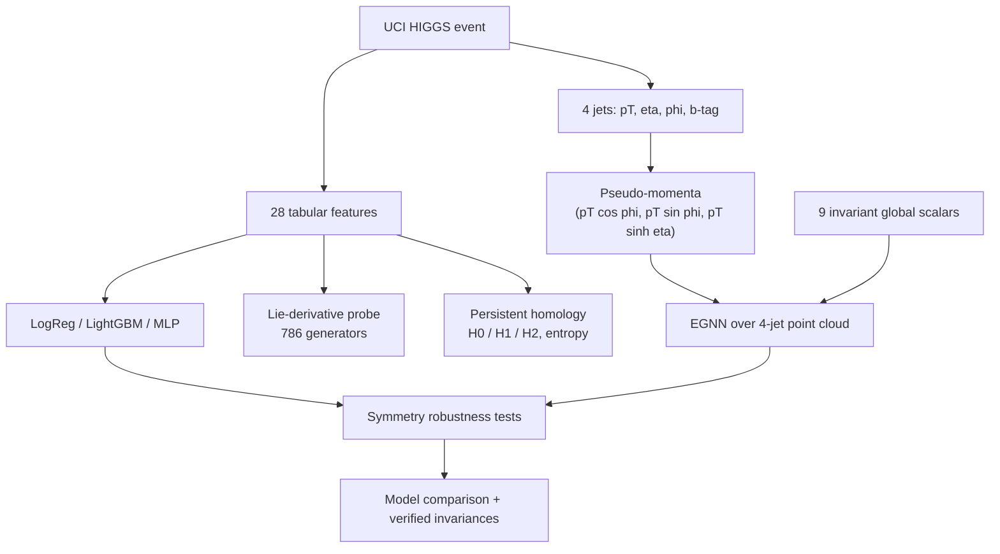

# TDA-and-EGNN-models-application-to-HIGGS-dataset
Topology-aware EGNN models with persistent homology features for Higgs Boson process in HIGGS

# Symmetry-Aware Analysis of the HIGGS Dataset: Baselines, Lie-Derivative Probes, TDA and an Equivariant GNN

**TL;DR:** This project tests whether physical symmetries (azimuthal rotation about the beam axis, jet permutation) can be detected in, and imposed on, machine-learning models for the UCI HIGGS signal/background classification task. The headline accuracy differences between a LightGBM baseline, a standard MLP and an E(3)-equivariant graph network are small (ROC-AUC 0.80–0.82 on a 200k subset, single seed), so the project should not be read as an accuracy claim. The more interesting results are diagnostic: a corrected symmetry-testing methodology (the dataset's angular features are standardized, and naive rotations silently test out-of-distribution robustness instead of symmetry), a Lie-derivative probe that includes the true physical U(1) generator, and an honest account of why full E(3) equivariance is *more* symmetry than collider physics has.

## Highlights

* Verified that the UCI HIGGS φ features are standardized (support ±√3), and defined the conversion constant `PHI_SIGMA = π/√3 ≈ 1.8138` used everywhere angular arithmetic is needed.
* Implemented a **correct** azimuthal-rotation test: un-standardize → rotate → wrap to [−π, π] → re-standardize, so rotated events stay in-distribution.
* Trained three baselines on a shared stratified split: Logistic Regression (AUC **0.6828**), LightGBM (AUC **0.8078**), PyTorch MLP (AUC **0.7996**).
* Under a true 90° azimuthal rotation the MLP's AUC is unchanged: **0.8034 → 0.8033**.
* Under jet-order reversal (an OOD diagnostic) the MLP degrades: **0.8034 → 0.7622**, revealing reliance on the pT-sorted input convention.
* Probed model insensitivity with empirical Lie derivatives over a basis of **786 generators**, now including the physical global-φ-shift (U(1)) generator; its score (**3.35e-03**, rank 38/786) is above the near-exact threshold, so no symmetry is claimed as "extracted".
* Ran exploratory persistent-homology analyses (H0/H1/H2, Betti curves, persistent entropy, bottleneck distances, lower-star filtration) with explicit small-sample caveats.
* Trained an EGNN on 4-jet pseudo-momentum point clouds: AUC **0.8196**, with z-rotation and jet-permutation invariance **verified numerically** to float32 error (max |Δlogit| ≈ 2e-06).
* Treated all comparisons as single-seed, single-split, different-representation results — differences of O(0.005) AUC are not attributed to equivariance.

## Why this matters

High-energy physics classification is a natural testbed for symmetry-aware machine learning: collider events have exact physical symmetries (azimuthal rotation about the beam axis, permutation of identical objects) that a good model should either learn or have built in.

But testing whether a model respects a symmetry is subtle when the dataset has been preprocessed. The UCI HIGGS features are not raw physical quantities — angles are standardized, transverse momenta are rescaled — so a "rotation" applied naively in feature space pushes events off the data support and measures out-of-distribution robustness, not symmetry. Similarly, a Lie-derivative basis of per-feature shifts cannot contain the physical rotation generator, which shifts all angles *simultaneously*.

This project is a corrected second pass over an earlier analysis that made both of these mistakes. The emphasis is on getting the units, the generators, and the claims right — and on being explicit about what an equivariant architecture does and does not guarantee physically.

## Abstract

This project investigates symmetry and topology in the UCI HIGGS dataset (Baldi, Sadowski & Whiteson, 2014) using a 200k-event subset with a shared 80/20 stratified split.

Three baselines (Logistic Regression, LightGBM, MLP) are compared with an E(n)-Equivariant Graph Neural Network that consumes each event's four jets as a 3D pseudo-momentum point cloud plus nine rotation-invariant global scalars.

Symmetry is probed three ways: (1) direct robustness tests under a correctly-implemented azimuthal rotation, jet-order reversal, and an η-shift; (2) empirical Lie derivatives of the trained MLP's logit along 786 generators including the physical U(1) generator; (3) architectural invariance tests of the EGNN.

The accuracy result is modest: the EGNN reaches ROC-AUC **0.8196** vs **0.8078** (LightGBM) and **0.7996** (MLP), but the EGNN sees a different input representation and only one seed was run, so this difference is not attributed to equivariance. The diagnostic results are cleaner: the MLP is insensitive to true azimuthal rotations (consistent with φ being nearly uninformative marginally — not proof of learned symmetry), it measurably relies on the pT-sorting convention, and the EGNN removes that reliance by construction while imposing a strictly larger symmetry group (E(3)) than the physics has (SO(2) about the beam axis plus parity).

Exploratory TDA (persistent homology of feature-space point clouds) is included with the explicit caveat that 100–500 points cannot estimate the topology of a 7–28-dimensional data manifold; the diagrams describe the samples, not established structure.

## Method overview



The project combines three complementary views of an event:

* **Tabular view:** the 28 features as-is, for baselines and Lie-derivative probes.
* **Geometric view:** jets embedded as a 3D point cloud, for the equivariant model.
* **Topological view:** feature-space point clouds summarized by persistent homology.

## 1. Dataset and units

Dataset: UCI HIGGS (11M simulated events; **200,000 used here**).
Features: 21 low-level kinematics (lepton/jet pT, η, φ, b-tags, MET) + 7 high-level invariant masses.
Target: signal (Higgs production) vs background. Classes are near-balanced (52.8% / 47.2%).

The features are **not raw physical quantities**. Following the original paper, signed features (η, φ) were standardized and strictly-positive features (pT, masses, MET) were scaled to mean 1. For angles this is invertible: raw φ is uniform on [−π, π] with

```math
\sigma_\varphi = \frac{\pi}{\sqrt{3}} \approx 1.8138
```

so standardized φ spans exactly ±√3 ≈ ±1.732. This is verified on the data:

```text
max |phi_std| over data:  1.7439
sqrt(3) =                 1.7321
```

For η and pT the original scale factors were not published and cannot be recovered; η-shifts are therefore expressed in σ-units and pT is treated as dimensionless.

## 2. Physical symmetries of the problem

A collider event's labeling function is invariant under:

* **global azimuthal rotation** about the beam (z) axis — all φ features shift together by the same Δφ (a U(1) symmetry);
* **permutation** of identical objects (the four jets);
* z-reflection (parity).

It is **not** invariant under arbitrary 3D rotations (the beam axis is special), nor under translations (momentum space has no translation symmetry). This distinction matters in Section 7.

## 3. Baselines

Logistic Regression, LightGBM and a two-hidden-layer MLP (BCE-with-logits, 10 epochs), all trained on the same stratified 160k/40k split.

| Model               | Test Accuracy | Test ROC-AUC |
| ------------------- | ------------: | -----------: |
| Logistic Regression |        0.6406 |       0.6828 |
| LightGBM            |        0.7275 |       0.8078 |
| PyTorch MLP         |        0.7231 |       0.7996 |

LightGBM feature importance (by gain, explicitly — the sklearn attribute defaults to split counts) is dominated by the Lorentz-invariant masses: `m_bb`, `m_wwbb`, `m_wbb`, `m_jjj`, then `jet1_pt`.

## 4. Symmetry robustness tests

### 4.1 Azimuthal rotation (the physical symmetry, done correctly)

Because φ is standardized, a correct rotation must un-standardize → add Δφ → wrap to [−π, π] → re-standardize. The result has the same support ±√3 as the originals, so the test measures symmetry, not OOD robustness.

| Test (MLP, Δφ = 90°) | Mean \|Δp\| | Max \|Δp\| | AUC before | AUC after |
| --------------------- | ----------: | ---------: | ---------: | --------: |
| Azimuthal rotation    |      0.0200 |     0.1608 |     0.8034 |    0.8033 |

Predictions barely move. This is **consistent with φ being nearly uninformative marginally, and is not proof that the model learned the symmetry.**

### 4.2 Jet-order reversal (OOD diagnostic)

The labeling function is permutation invariant, but the dataset always presents jets sorted by pT, so reversed events are out-of-distribution for a model that learned the "jet 1 is leading" heuristic.

| Test (MLP)         | Mean \|Δp\| | Max \|Δp\| | AUC before | AUC after |
| ------------------ | ----------: | ---------: | ---------: | --------: |
| Jet order reversal |      0.0943 |     0.7259 |     0.8034 |    0.7622 |

The degradation is substantial: the MLP relies on the pT-sorting convention.

### 4.3 η-shift probe (not a Lorentz boost)

A global η shift of 0.5 σ-units (a heuristic probe; the σ→rapidity scale is unrecoverable):

| Model        | Mean \|Δp\| | AUC base | AUC shifted |
| ------------ | ----------: | -------: | ----------: |
| LightGBM     |      0.0084 |   0.8078 |      0.8073 |
| Standard MLP |      0.0081 |   0.7996 |      0.7989 |

## 5. Extracting symmetries via Lie derivatives

For a trained model `f` and vector field `v`, the empirical Lie derivative

```math
\mathcal{L}_v f(x) = \nabla f(x) \cdot v(x)
```

measures first-order insensitivity along `v`. The generator basis (786 total) contains:

* the **physical U(1) generator** — a *simultaneous* shift of all six φ features (the correction over the first pass, which only had per-feature shifts and over-interpreted them as "discovered rotation invariance");
* a heuristic global η shift;
* all 28 per-feature translations;
* all 756 pairwise rotation-like and scaling-like feature mixings.

Score = mean squared Lie derivative of the MLP logit over 2000 test events (lower = more insensitive), against a near-exact threshold of 1e-4:

| Generator                       |    Score | Verdict |
| ------------------------------- | -------: | ------- |
| PHYSICAL: global φ shift (U(1)) | 3.35e-03 | only approximately insensitive (rank 38 of 786) |
| HEURISTIC: global η shift       | 2.43e-03 | approximate |
| Best per-feature φ translation  | 1.75e-03 | model insensitivity, **not** a physical symmetry |
| Best pairwise φ–φ mixing        | 1.70e-03 | feature-space probe, no direct physical meaning |

### Interpretation

No generator scores below the near-exactness threshold, so no symmetry is declared "extracted". Low φ-sensitivity is expected regardless of symmetry learning, because marginal φ is nearly uninformative for the label. Per-feature φ shifts change the inter-object angles Δφ and are not physical symmetries; jet permutations are discrete and not expressible as infinitesimal generators at all.

## 6. Topological data analysis (exploratory)

Persistent homology (Vietoris–Rips, `ripser`/`gudhi`) of feature-space point clouds. **Caveat stated up front:** 100–500 points cannot estimate the topology of a 7–28-dimensional manifold, and H0/H1 counts are not comparable across ambient dimensions. These results describe the samples.

### 6.1 Feature-subset comparison (200 points each)

| Space                 | H1 count | Mean H1 lifespan | Max H1 lifespan |
| --------------------- | -------: | ---------------: | --------------: |
| Raw (28D)             |      232 |           0.2325 |          0.7638 |
| φ-dropped (22D)       |      161 |           0.1951 |          0.7232 |
| Invariant masses (7D) |       91 |           0.0906 |          0.4174 |

### 6.2 Other topological probes

* **H2 homology** (100 points): 87 H1 and 56 H2 features, mean persistences 0.26 and 0.10 — short-lived, noise-scale.
* **Persistent entropy** (300 points/class): signal H0/H1 = 5.684/5.473 vs background 5.683/5.508 — essentially indistinguishable.
* **Bottleneck distances** between signal and background diagrams (500 points/class): H0 = 1.43, H1 = 0.52.
* **Lower-star filtration** on a k-NN density graph (Gudhi, 800 points, k=10): 110 H0 features, no H1.

None of these separate signal from background convincingly at these sample sizes.

## 7. Equivariant model: EGNN on jet point clouds

### 7.1 Representation

Each event's four jets are embedded as 3D **pseudo-momenta** (with φ correctly converted to radians first):

```math
(p_T, \eta, \varphi) \mapsto (p_T \cos\varphi,\; p_T \sin\varphi,\; p_T \sinh\eta)
```

Node features: pT and b-tag. Global scalars: lepton pT, MET magnitude, and the 7 invariant masses (all z-rotation invariant). Lepton η/φ and MET φ are intentionally dropped — the EGNN sees *less* information than the flat baselines.

### 7.2 Symmetry respect box

| Transformation | Physical symmetry? | EGNN respects it? |
| --- | --- | --- |
| Rotation about beam (z) axis | **Yes** (SO(2)) | Yes — via pairwise distances |
| Arbitrary 3D rotation | **No** (beam axis is special) | Yes (imposed, unphysical) |
| Translation of all momenta | **No** | Yes (imposed, unphysical) |
| Jet permutation | **Yes** | Yes — mean pooling |

The EGNN imposes a **strictly larger symmetry group than the physics has**. That acts as an inductive-bias regularizer, not as "physics-correct equivariance". A physically exact model would be SO(2)-equivariant about z (plus parity).

### 7.3 Verified invariances

| Test | Mean \|Δlogit\| | Max \|Δlogit\| | Verdict |
| --- | ---: | ---: | --- |
| 90° rotation about z | 2.30e-07 | 1.91e-06 | invariant to float32 error |
| Jet permutation (reversed) | 3.10e-07 | 1.67e-06 | invariant to float32 error |
| η-shift 0.5σ (not a symmetry) | 1.52e-01 | 1.83e+00 | changes, as expected |

## 8. Results

All models are evaluated on the same 40k test rows.

| Model               | ROC-AUC | PR-AUC | Accuracy | Precision | Recall |     F1 | Perm.-invariant | z-rot.-invariant |
| ------------------- | ------: | -----: | -------: | --------: | -----: | -----: | :-------------: | :--------------: |
| LightGBM (baseline) |  0.8078 | 0.8227 |   0.7274 |    0.7400 | 0.7464 | 0.7432 |       No        |        No        |
| Standard MLP        |  0.7996 | 0.8128 |   0.7231 |    0.7336 | 0.7474 | 0.7404 |       No        |        No        |
| EGNN (equivariant)  |  0.8196 | 0.8327 |   0.7376 |    0.7655 | 0.7259 | 0.7451 |  Yes (verified) |  Yes (verified)  |

### Interpretation

The EGNN's +0.012 AUC over LightGBM comes from a single seed, a single split, and a *different input representation* (no lepton η/φ, no MET φ), so it is not attributable to equivariance alone.

> The reliable conclusions are the diagnostic ones: the MLP's azimuthal insensitivity reflects the low marginal informativeness of φ rather than learned symmetry; jet-order reversal exposes a genuine reliance on the pT-sorting convention; and the EGNN removes that reliance by construction — at the cost of imposing symmetries the physics does not have.

## 9. Main conclusions

1. Getting the units right is a precondition for symmetry testing: naive rotations of standardized angles test OOD robustness, not symmetry.
2. All three models perform comparably (ROC-AUC 0.80–0.82); differences are within single-seed noise and representation differences.
3. The MLP is robust to true azimuthal rotations but this is expected regardless of symmetry learning; it is *not* robust to jet reordering.
4. A Lie-derivative basis must contain the physical generator (simultaneous φ shift) to say anything about physical symmetry; even then, the trained MLP is only approximately insensitive (score 3.35e-03, above the 1e-4 near-exact threshold).
5. The EGNN's permutation and rotation invariances are exact by construction (verified to float32 error), but its E(3) group is larger than the physical SO(2)-about-beam-axis symmetry — an imposed approximation.
6. The exploratory TDA finds no convincing topological separation between signal and background at these sample sizes.

## 10. Limitations

* Single seed and a single train/test split; AUC differences of O(0.005) are not statistically meaningful here.
* 200k of 11M rows; conclusions may shift with the full dataset.
* The EGNN and the flat baselines consume different input representations, confounding the architecture comparison.
* The η and pT standardization constants of the original dataset are unrecoverable, so η-shift probes are heuristic (σ-units) and pseudo-momenta distort the longitudinal component by an unknown monotone rescaling.
* TDA samples (100–800 points) are far too sparse for manifold-topology claims; Rips complexes scale between O(N²) and O(N³).
* The Lie-derivative probe is first-order and local; it cannot see discrete symmetries (permutations) or finite transformations.

## 11. Future work

* Multi-seed training and full-dataset runs to put error bars on the model comparison.
* An SO(2)-about-z (+ parity) equivariant architecture — the physically exact symmetry group — compared against the E(3) EGNN on identical inputs.
* Feed the EGNN the full event (lepton and MET as additional nodes) to remove the representation confound.
* Symmetry-augmented training (random azimuthal rotations, jet shuffling) as a cheaper alternative to architectural equivariance.
* Learned or differentiable topological features rather than fixed persistence summaries.

## Reproducibility

The entire analysis lives in one notebook:

```text
study_ipynb/third_try/
  higgs_corrected_second_pass.ipynb   # this analysis
  Higgs_corrected.ipynb               # first pass (superseded)
  build_second_pass.py                # notebook build script
  HIGGS.csv.gz                        # dataset (downloaded on first run, 2.6 GB)
```

Dependencies are installed by the first cell:

```bash
pip install pandas numpy matplotlib seaborn scipy scikit-learn lightgbm \
            ripser persim gudhi torch egnn_pytorch
```

The notebook downloads `HIGGS.csv.gz` from the UCI archive if it is not present. The download occasionally stalls — delete the partial file and restart. A GPU is used if available (results above: CUDA, PyTorch 2.11).

Key reproducibility choices: one stratified `train_test_split` (seed 42) is made **once, as indices**, and reused by every model, symmetry test and TDA subsample; scalers are fit on the training split only; `torch.manual_seed(42)` before each model.

## Technical stack

* Python, PyTorch
* E(n)-Equivariant Graph Neural Networks (`egnn_pytorch`)
* LightGBM, scikit-learn
* Persistent homology (`ripser`, `persim`, `gudhi`)
* Lie-derivative symmetry probes (autograd)
* UCI HIGGS dataset

## About

This is a corrected second pass over an earlier HIGGS analysis, with the emphasis on methodological honesty: fixing the angular units before testing rotations, including the true physical generator in the Lie-derivative basis, claiming only invariances that were numerically verified, and stating explicitly when an architecture imposes more symmetry than the physics has.
